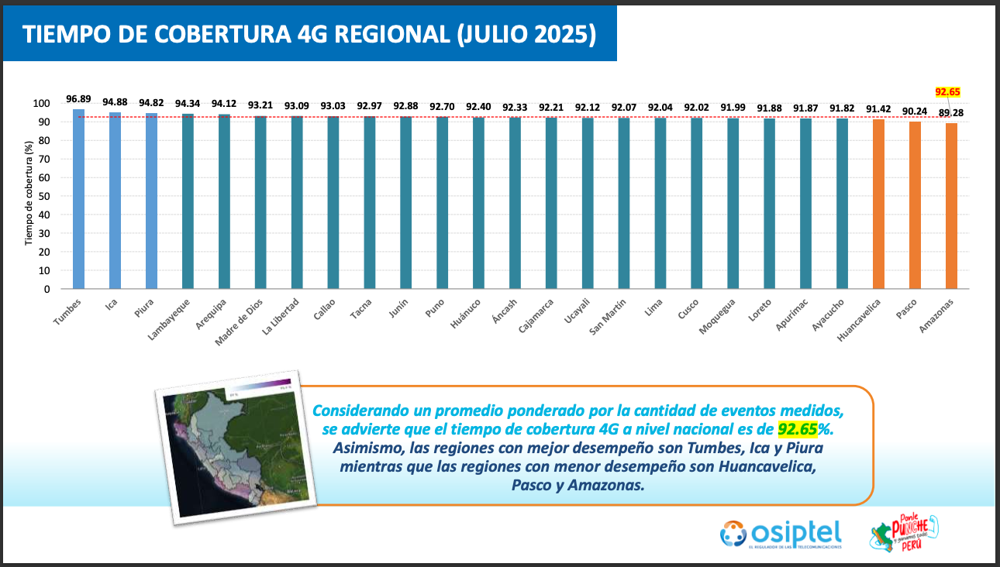

# performance-analysis
Front-end performance analysis with Sitespeed.io.

### Connectivity profiles (upload / download / RTT)

The table below lists the built-in profiles that **Sitespeed.io / Browsertime** exposes through `--connectivity.profile`. Bandwidth values are expressed in **kbit/s** (upload and download) and round trip time in **ms**.

| Profile  | Upload (kbit/s) | Download (kbit/s) | RTT (ms) | Approx. Download (Mbps) |
|---------:|----------------:|------------------:|---------:|------------------------:|
| **4g**   | 9000            | 9000              | 85       | ~9.00 Mbps              |
| **3g**   | 768             | 1600              | 150      | ~1.60 Mbps              |
| **3gfast** | 768           | 1600              | 75       | ~1.60 Mbps              |
| **3gslow** | 400           | 400               | 200      | ~0.40 Mbps              |
| **3gem** | 400             | 400               | 200      | ~0.40 Mbps              |
| **2g**   | 256             | 280               | 400      | ~0.28 Mbps              |
| **cable**| 1000            | 5000              | 14       | ~5.00 Mbps              |

**Tip:** If you need to override these defaults, create a `custom` profile with `--connectivity.down`, `--connectivity.up`, and `--connectivity.rtt`, or configure the `throttle` service manually. See the [Sitespeed.io throttle documentation](https://www.sitespeed.io/documentation/throttle) for details.

### Peru mobile baseline (July 2025)

According to OSIPTEL’s national monitoring panel, 4G remains the most used mobile access in Peru, with subscribers connected to 4G networks 92.65% of the time and experiencing an average 4G download speed of 12.16 Mbps in July 2025. [OSIPTEL press release, 29 Aug 2025](https://www.gob.pe/institucion/osiptel/noticias/1235780-osiptel-estos-fueron-los-indicadores-de-calidad-de-internet-movil-en-julio-de-2025)



*Source: Panel de Monitoreo de Internet Móvil, consolidated report for July 2025 (page 15).* [PDF](https://sociedadtelecom.pe/wp-content/uploads/2025/08/Panel_de_Monitoreo_Internet_Movil_Consolidado_Julio_2025.pdf)

### Running a test

1. Install the dependencies (one-time setup):
   ```bash
   npm install
   ```
2. Execute a run with the project configuration using the npm script:
   ```bash
   npm run perf -- "<url-here>"
   ```
3. Review the HTML report output under `./sitespeed-result/` (a timestamped folder is created per run).

**Important:** The `throttle` connectivity engine tweaks your system network rules to emulate slow links and those changes persist until you remove them. After you finish your tests, run `sudo throttle --stop` to restore your normal bandwidth (otherwise all your apps will keep using the throttled profile). You can check whether throttling is still active with `sudo throttle --status`.
